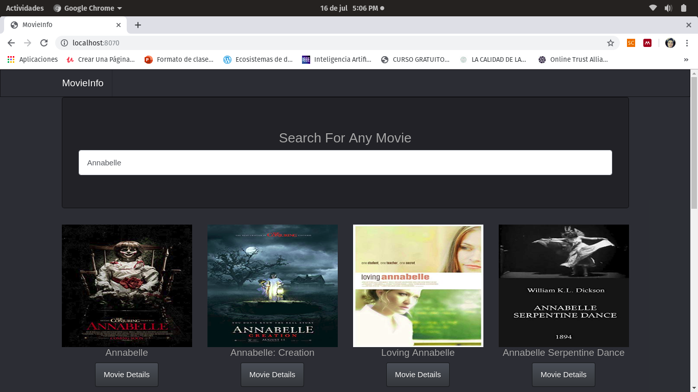
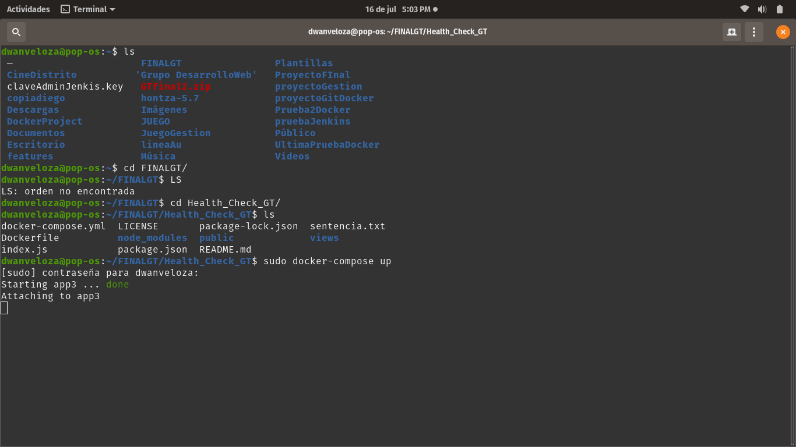
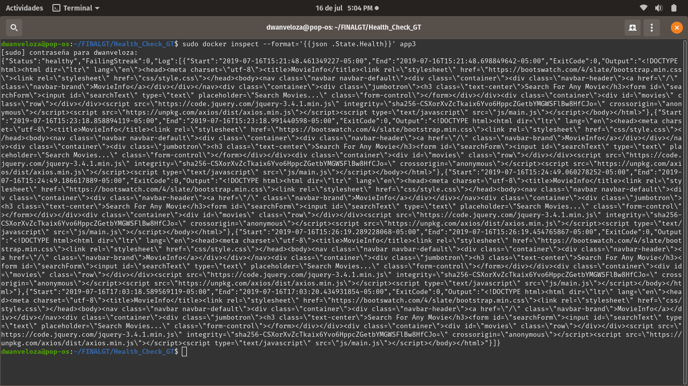
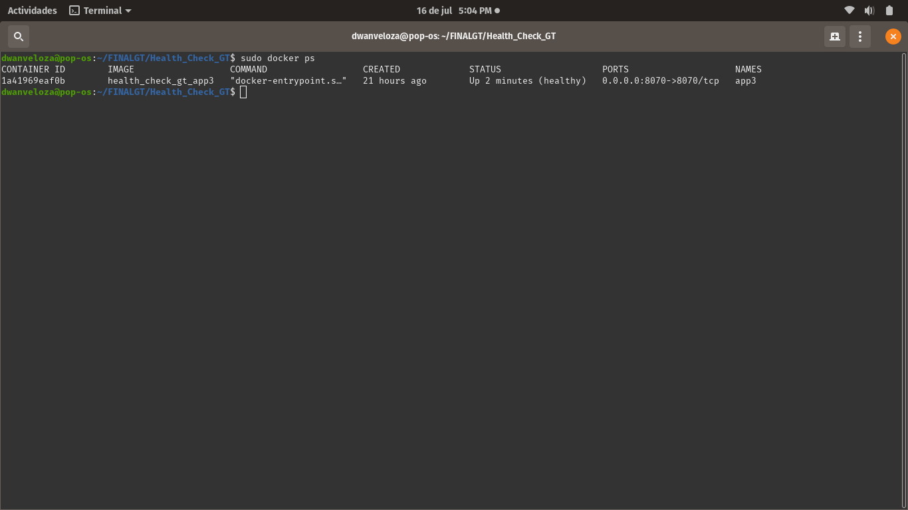
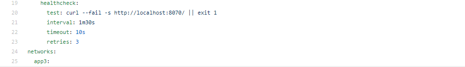

# Implementación de Health Check para un servicio de consumo de películas

## Integrantes

### Dwan Felipe Veloza Paez
### Anderson Fabian Solano Cubillos
### Lucas Blandón Pulido
### Sebastina López
### Daniel Felipe Pepinosa Camargo
### Ivan René Arévalo Venegas

# :ledger: Pasos

#  1) npm-install

## Este comando instala un paquete y cualquier paquete del que dependa. Si el paquete tiene un archivo package-lock la instalación de las dependencias será impulsada por eso, con un npm-shrinkwrap.json teniendo prioridad si ambos archivos existen. 

### Un paquete es:

    a) una carpeta que contiene un programa descrito por un archivo package.json
    b) un tarball comprimido que contiene (a)
    c) una url que resuelve a (b)
    d) un <nombre> @ <versión> que se publica en el registro (consulte npm-registro) con (c)
    e) un <nombre> @ <tag> (ver npm-dist-tag) que apunta a (d)
    f) un <nombre> que tiene una etiqueta "más reciente" que satisface (e)
    g) un <git url remoto> que se resuelve en (a)
    
  ## Instale las dependencias en la carpeta local node_modules.
  
  # 2) sudo docker-compose up
  
  
  
  ## comando agrega la salida de cada contenedor (esencialmente en ejecución).
### Si existen contenedores para un servicio y la configuración o la imagen del servicio se modificó después de la creación del contenedor, la ventana acoplable-compilación recoge los cambios al detener y recrear los contenedores (conservando los volúmenes montados). Para evitar que Compose recoja los cambios.

 ### La funcionalidad de healthcheck permite proporcionar un comando o script de verificación de estado del contenedor o tarea. De esta forma, podemos detectar problemas de servicio cuando el proceso maestro está en ejecución, por ejemplo cuando el rendimiento de nuestra aplicación se ve afectado.
### Es posible configurar el intervalo entre verificaciones de estado, el tiempo de respuesta/finalización del script o comando y el número de ejecuciones que deben ser erróneas antes de indicar el contenedor/tarea como erróneo o caído. Simplemente con un script o comando y su salida podremos gestionar el comportamiento.

#  3) sudo docker inspect --format='{{json .State.Health}}' app3

## La salud del contenedor no se indica hasta la primera ejecución del script o comando.Tras pasar el intervalo de tiempo óptimo podemos observar que el comando es correcto y tiene por respuesta “healthy”

#  4) sudo docker ps

## solo muestra contenedores en ejecución por defecto. Si deseamos saber de todos los contenedores, podemos usar -a(o --all):
### docker ps agrupa los puertos expuestos en un solo rango si es posible. En el ejercicio final, un contenedor que expone los puertos TCP 0.0.0.0:8070->8070/tcp, donde se expondrá la información del aplicativo en la ejecución desde la web 
 

### La información correspondiente a cada ítem del docker ps: 

## Id: Identificador del contenedor
## Image: Las imágenes de nivel superior, información del repositorio, etiquetas y tamaño, corresponde a la información del app3 donde se encuentra el proyecto
## Command: docker-entrypoint.sh  inicializa datos con estado en un contenedor en tiempo de ejecución
## Created: Información del tiempo de la creación del proyecto
## Status: Corresponde al tiempo de respuesta del contenedor con respecto a la petición de la prueba de salud, si está por debajo en la definición del healthcheck, en el interval: 1m30s se considera dentro del docker ps que el status es “healthy”

## Ports: El rango de puertos utilizados para la ejecución del proyecto; corresponden de 0.0.0.0:8070 -> 8070
## Name: Nombre del contenedor

# 5) Sudo docker inspect

## Devuelve información de bajo nivel sobre objetos Docker.

### Docker inspect proporciona información detallada sobre construcciones controladas por Docker. De forma predeterminada, los resultados se mostrarán en una matriz JSON.

